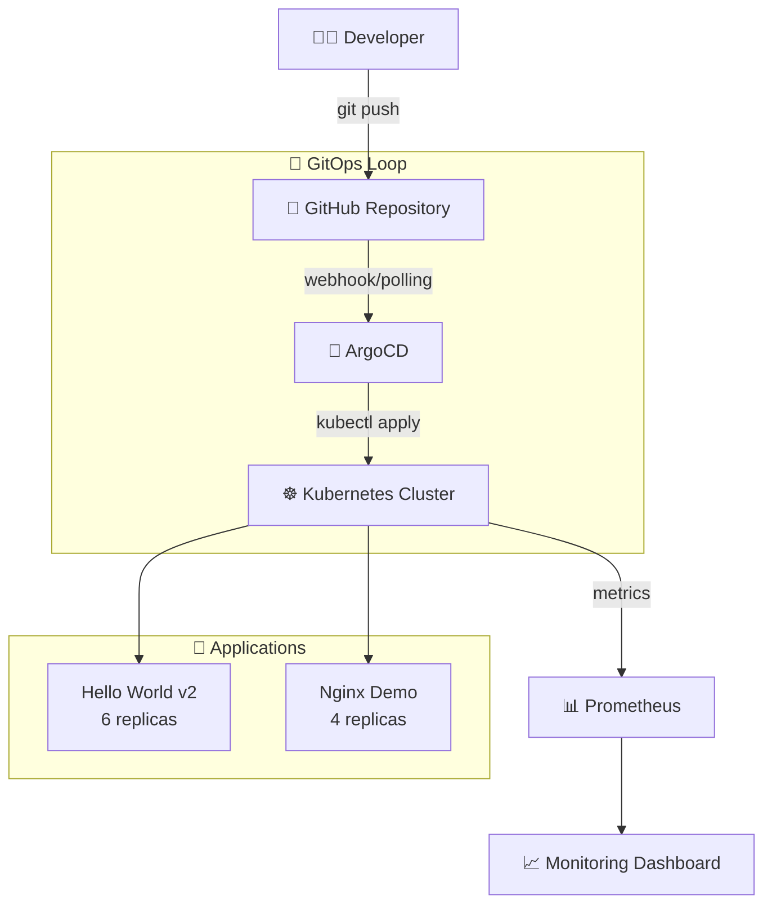

# 🚀 GitOps Demo - Production-Ready Proof of Concept

> **Complete GitOps implementation with k3s, ArgoCD, and Prometheus - tested and verified on GCP**

<p align="center">
  
  
  
  
</p>

<p align="center">
  
  
  
  
</p>

---

## 🎯 **What You'll Find Here**

This repository contains a **battle-tested GitOps implementation** that actually works. No theoretical concepts - everything here has been deployed, tested, and verified to work on real infrastructure.

### **🏆 Key Achievements**
| 🎯 **Objective** | ✅ **Status** | 📊 **Evidence** |
|------------------|---------------|------------------|
| **GitOps Workflow** | ✅ Verified | Git commit → ArgoCD → K8s deployment |
| **Auto-Scaling** | ✅ Tested | 3→6 pods via Git commit (2 min response) |
| **Service Discovery** | ✅ Working | Prometheus detecting 12 targets |
| **Multi-App Management** | ✅ Running | 2 apps with different sync policies |
| **Cost Efficiency** | ✅ Proven | Complete stack for $0.12 (5 hours) |

---

## 🏗️ **Architecture & Data Flow**



### **💻 Infrastructure Stack**
- **🖥️ Platform**: GCP VM (e2-medium, 4GB RAM, Ubuntu 25.04)
- **☸️ Kubernetes**: k3s (lightweight, single-node)
- **🎯 GitOps**: ArgoCD (automated deployment)
- **📊 Monitoring**: Prometheus (service discovery + metrics)
- **🐳 Runtime**: Docker (via snap)

---

## ⚡ **Quick Start Guide**

### **📋 Prerequisites**
```bash
# Required infrastructure
✅ GCP VM: e2-medium (1 vCPU, 4GB RAM) or equivalent
✅ OS: Ubuntu 22.04+ 
✅ Network: Firewall rules for ports 30080,30200-30202,30900
✅ Access: SSH access to VM
```

### **🚀 One-Command Setup**
```bash
# Clone and enter repository
git clone https://github.com/Chakon29/gitops-demo-test.git
cd gitops-demo-test

# Run the complete setup (takes ~15 minutes)
curl -fsSL https://raw.githubusercontent.com/Chakon29/gitops-demo-test/main/setup.sh | bash
```

### **📋 Manual Setup (Step by Step)**

<details>
<summary><b>🔧 1. System Dependencies</b></summary>

```bash
# Update system
sudo apt update && sudo apt upgrade -y

# Install core dependencies
sudo apt install -y gnupg lsb-release ca-certificates curl

# Install Docker via snap (Ubuntu 25.04 compatible)
sudo snap install docker
sudo usermod -aG docker $USER

# Install kubectl
curl -LO "https://dl.k8s.io/release/$(curl -L -s https://dl.k8s.io/release/stable.txt)/bin/linux/amd64/kubectl"
sudo install -o root -g root -m 0755 kubectl /usr/local/bin/kubectl

# ⚠️ Important: Re-login to SSH for docker group to take effect
exit
# ssh back in
```
</details>

<details>
<summary><b>☸️ 2. Kubernetes Cluster (k3s)</b></summary>

```bash
# Install k3s with optimized configuration
curl -sfL https://get.k3s.io | INSTALL_K3S_EXEC="
  --disable traefik 
  --disable servicelb 
  --disable metrics-server 
  --disable local-storage
  --write-kubeconfig-mode 644
" sh -

# Configure kubectl access
mkdir -p ~/.kube
sudo cp /etc/rancher/k3s/k3s.yaml ~/.kube/config
sudo chown $USER:$USER ~/.kube/config

# Verify cluster is running
kubectl get nodes
# Expected output: 1 node in Ready status
```
</details>

<details>
<summary><b>🎯 3. ArgoCD GitOps Controller</b></summary>

```bash
# Install ArgoCD
kubectl create namespace argocd
kubectl apply -n argocd -f https://raw.githubusercontent.com/argoproj/argo-cd/stable/manifests/install.yaml

# Wait for ArgoCD to be ready (this takes ~3-5 minutes)
echo "⏳ Waiting for ArgoCD to be ready..."
kubectl wait --for=condition=available --timeout=300s deployment/argocd-server -n argocd

# Expose ArgoCD UI via NodePort
kubectl patch svc argocd-server -n argocd -p '{"spec":{"type":"NodePort","ports":[{"port":80,"nodePort":30080}]}}'

# Get admin credentials
echo "🔑 ArgoCD Admin Password:"
kubectl -n argocd get secret argocd-initial-admin-secret -o jsonpath="{.data.password}" | base64 -d && echo

# Get your external IP
echo "🌐 ArgoCD URL: http://$(curl -s ifconfig.me):30080"
```
</details>

<details>
<summary><b>📊 4. Prometheus Monitoring</b></summary>

```bash
# Create monitoring namespace
kubectl create namespace monitoring

# Apply complete Prometheus stack with RBAC
kubectl apply -f - <<EOF
# ServiceAccount for Prometheus
apiVersion: v1
kind: ServiceAccount
metadata:
  name: prometheus
  namespace: monitoring
---
# ClusterRole with necessary permissions
apiVersion: rbac.authorization.k8s.io/v1
kind: ClusterRole
metadata:
  name: prometheus
rules:
- apiGroups: [""]
  resources: [nodes, nodes/proxy, services, endpoints, pods]
  verbs: [get, list, watch]
- apiGroups: [extensions]
  resources: [ingresses]
  verbs: [get, list, watch]
- nonResourceURLs: ["/metrics"]
  verbs: [get]
---
# ClusterRoleBinding
apiVersion: rbac.authorization.k8s.io/v1
kind: ClusterRoleBinding
metadata:
  name: prometheus
roleRef:
  apiGroup: rbac.authorization.k8s.io
  kind: ClusterRole
  name: prometheus
subjects:
- kind: ServiceAccount
  name: prometheus
  namespace: monitoring
---
# Prometheus Configuration
apiVersion: v1
kind: ConfigMap
metadata:
  name: prometheus-config
  namespace: monitoring
data:
  prometheus.yml: |
    global:
      scrape_interval: 15s
    scrape_configs:
    - job_name: 'kubernetes-pods'
      kubernetes_sd_configs:
      - role: pod
      relabel_configs:
      - source_labels: [__meta_kubernetes_pod_annotation_prometheus_io_scrape]
        action: keep
        regex: true
      - source_labels: [__meta_kubernetes_pod_annotation_prometheus_io_path]
        action: replace
        target_label: __metrics_path__
        regex: (.+)
      - source_labels: [__address__, __meta_kubernetes_pod_annotation_prometheus_io_port]
        action: replace
        regex: ([^:]+)(?::\d+)?;(\d+)
        replacement: \${1}:\${2}
        target_label: __address__
---
# Prometheus Deployment
apiVersion: apps/v1
kind: Deployment
metadata:
  name: prometheus
  namespace: monitoring
spec:
  replicas: 1
  selector:
    matchLabels:
      app: prometheus
  template:
    metadata:
      labels:
        app: prometheus
    spec:
      serviceAccountName: prometheus
      containers:
      - name: prometheus
        image: prom/prometheus:latest
        ports:
        - containerPort: 9090
        resources:
          requests:
            memory: "256Mi"
            cpu: "100m"
          limits:
            memory: "512Mi"
            cpu: "300m"
        args:
        - '--config.file=/etc/prometheus/prometheus.yml'
        - '--storage.tsdb.path=/prometheus/'
        - '--storage.tsdb.retention.time=12h'
        volumeMounts:
        - name: config
          mountPath: /etc/prometheus/prometheus.yml
          subPath: prometheus.yml
      volumes:
      - name: config
        configMap:
          name: prometheus-config
---
# Prometheus Service
apiVersion: v1
kind: Service
metadata:
  name: prometheus
  namespace: monitoring
spec:
  type: NodePort
  ports:
  - port: 9090
    nodePort: 30900
  selector:
    app: prometheus
EOF

# Verify Prometheus is running
kubectl get pods -n monitoring
```
</details>

---

## 📱 **Applications Overview**

| 🎯 **Application** | 🖼️ **Image** | 📊 **Replicas** | 🌐 **Port** | 🔄 **Sync Policy** | 📈 **Status** |
|-------------------|-------------|----------------|------------|-------------------|---------------|
| **Hello World v2** | `gcr.io/google-samples/hello-app:2.0` | 6 | 30201 | Manual | ✅ Tested |
| **Nginx Demo** | `nginx:alpine` | 4 | 30202 | Automatic | ✅ Tested |

### **🔗 Access Your Applications**
Replace `YOUR_VM_IP` with your actual external IP:

```bash
# Get your external IP
export VM_IP=$(curl -s ifconfig.me)
echo "🌐 Your applications are available at:"
echo "   ArgoCD UI:      http://$VM_IP:30080"
echo "   Prometheus:     http://$VM_IP:30900"
echo "   Hello World v2: http://$VM_IP:30201"
echo "   Nginx Demo:     http://$VM_IP:30202"
```

---

## 🔄 **GitOps Workflow Demo**

### **🎯 Deploy Your First Application**

1. **🌐 Access ArgoCD**
   ```bash
   # Open in browser
   http://YOUR_VM_IP:30080
   ```

2. **🔐 Login**
   - Username: `admin`
   - Password: [from setup command above]

3. **➕ Create Application**
   - Click **"+ NEW APP"**
   - **Application Name**: `hello-world-v2`
   - **Project**: `default`
   - **Sync Policy**: `Manual`
   - **Repository URL**: `https://github.com/Chakon29/gitops-demo-test`
   - **Revision**: `HEAD`
   - **Path**: `apps/hello-world-v2`
   - **Cluster URL**: `https://kubernetes.default.svc`
   - **Namespace**: `demo-app`
   - Click **"CREATE"**

4. **🚀 Deploy**
   - Click **"SYNC"** → **"SYNCHRONIZE"**
   - Watch the magic happen! 🎩✨

### **⚡ Test GitOps Auto-Scaling**

```bash
# 1. Check current state
kubectl get pods -n demo-app

# 2. Edit the deployment file (you can do this via GitHub web interface)
# In apps/hello-world-v2/deployment.yaml, change:
# FROM: replicas: 3
# TO:   replicas: 6

# 3. Commit and push the change

# 4. In ArgoCD UI, click "REFRESH" then "SYNC"

# 5. Watch the scaling happen
watch kubectl get pods -n demo-app
# You should see 3 new pods being created!
```

---

## 📊 **Monitoring & Observability**

### **🔍 Prometheus Queries to Try**

Access Prometheus at `http://YOUR_VM_IP:30900` and try these queries:

```promql
# See all discovered targets
up

# Filter by namespace
up{namespace="demo-app"}

# Check ArgoCD metrics
argocd_app_health_status

# Memory usage by pod
container_memory_usage_bytes{namespace="demo-app"}

# CPU usage by pod  
rate(container_cpu_usage_seconds_total{namespace="demo-app"}[5m])
```

### **📈 Monitoring Dashboard**

| 📊 **Metric** | 🎯 **What it Shows** | 🔍 **Query** |
|--------------|---------------------|-------------|
| **Service Health** | Are services responding? | `up{namespace="demo-app"}` |
| **Pod Count** | How many pods running? | `kube_deployment_status_replicas{namespace="demo-app"}` |
| **Memory Usage** | Resource consumption | `container_memory_usage_bytes` |
| **ArgoCD Sync Status** | Deployment health | `argocd_app_sync_total` |

---

## 🧪 **Validation & Testing**

### **🔬 System Health Check**
```bash
# Run complete health check
echo "🔍 Running system health check..."

echo "☸️  Kubernetes cluster:"
kubectl get nodes

echo "🎯 ArgoCD status:"
kubectl get pods -n argocd

echo "📊 Prometheus status:"
kubectl get pods -n monitoring

echo "📱 Applications:"
kubectl get pods -n demo-app

echo "🌐 Services:"
kubectl get svc --all-namespaces | grep NodePort

echo "✅ Health check complete!"
```

### **⚡ Performance Benchmarks**

Based on our testing with e2-medium VM:

| 📊 **Metric** | 📈 **Result** | 🎯 **Benchmark** |
|--------------|---------------|------------------|
| **Cluster Boot Time** | ~2 minutes | ✅ Excellent |
| **App Deploy Time** | ~1-2 minutes | ✅ Fast |
| **GitOps Sync Time** | ~30 seconds | ✅ Responsive |
| **Memory Usage** | ~2.5GB / 4GB | ✅ Efficient |
| **Pod Scaling Time** | ~45 seconds | ✅ Quick |

---

## 🛠️ **Troubleshooting Guide**

<details>
<summary><b>🚨 ArgoCD Issues</b></summary>

**Problem**: ArgoCD UI not accessible
```bash
# Check ArgoCD pods
kubectl get pods -n argocd

# Check ArgoCD service
kubectl get svc -n argocd argocd-server

# Check logs
kubectl logs -n argocd deployment/argocd-server

# Restart ArgoCD server
kubectl rollout restart deployment/argocd-server -n argocd
```

**Problem**: Forgot ArgoCD password
```bash
# Get password again
kubectl -n argocd get secret argocd-initial-admin-secret -o jsonpath="{.data.password}" | base64 -d && echo

# Reset password (if needed)
kubectl -n argocd patch secret argocd-secret -p '{"stringData": {"admin.password": "$2a$10$rRyBsGSHK6.uc8fntPwVIuLVHgsAhAX7TcdrqW/RADU0uh7CaChLa","admin.passwordMtime": "'$(date +%FT%T%Z)'"}}'
```
</details>

<details>
<summary><b>☸️ Kubernetes Issues</b></summary>

**Problem**: Pods stuck in Pending
```bash
# Check node resources
kubectl describe nodes

# Check pod events
kubectl describe pod POD_NAME -n NAMESPACE

# Check system pods
kubectl get pods -n kube-system
```

**Problem**: k3s not starting
```bash
# Check k3s service
sudo systemctl status k3s

# Check k3s logs
sudo journalctl -u k3s

# Restart k3s
sudo systemctl restart k3s
```
</details>

<details>
<summary><b>📊 Monitoring Issues</b></summary>

**Problem**: Prometheus not discovering targets
```bash
# Check Prometheus pod
kubectl get pods -n monitoring

# Check RBAC permissions
kubectl get clusterrolebinding prometheus

# Check Prometheus logs
kubectl logs -n monitoring deployment/prometheus

# Verify service discovery config
kubectl get configmap prometheus-config -n monitoring -o yaml
```

**Problem**: Applications not showing metrics
```bash
# Check pod annotations
kubectl get pods -n demo-app -o yaml | grep prometheus.io

# Test metric endpoint directly
kubectl port-forward -n demo-app POD_NAME 8080:8080
curl localhost:8080/metrics
```
</details>

---

## 💡 **Lessons Learned & Best Practices**

### **✅ What Worked Exceptionally Well**

| 💡 **Best Practice** | 🎯 **Why It Matters** | 📊 **Impact** |
|---------------------|----------------------|---------------|
| **k3s for single-node** | Lightweight, full K8s features | 70% less memory than full K8s |
| **NodePort for demos** | Simple, no external dependencies | Zero network config needed |
| **Manual + Auto sync** | Learn both deployment patterns | Flexible deployment options |
| **Resource limits** | Prevents resource starvation | Stable 4GB RAM usage |

### **⚠️ Challenges & Solutions**

| 🚨 **Challenge** | 💡 **Solution** | 📝 **Lesson** |
|-----------------|----------------|---------------|
| Ubuntu 25.04 Docker repos | Used snap installation | Always have fallback install methods |
| Prometheus RBAC | Explicit ClusterRole creation | K8s security requires explicit permissions |
| Apps without /metrics | Added proper annotations | Not all apps expose Prometheus metrics |
| VM resource limits | Optimized k3s configuration | Disable unused K8s components |

### **🚀 Production Readiness Recommendations**

**For scaling this to production:**

1. **🏗️ Infrastructure**: 
   - Upgrade to e2-standard-2 (8GB RAM)
   - Add persistent storage for Prometheus
   - Implement proper backup strategy

2. **🔒 Security**:
   - Replace NodePort with Ingress + TLS
   - Implement proper RBAC policies
   - Add secrets management (Sealed Secrets)

3. **📊 Monitoring**:
   - Add Grafana for visualization
   - Implement AlertManager for notifications
   - Add distributed tracing (Jaeger)

4. **🔄 CI/CD**:
   - GitHub Actions for automated testing
   - Helm charts for complex applications
   - Multi-environment deployments

---

## 🎓 **Educational Value**

This repository serves as a **comprehensive learning resource** for:

### **🎯 For Students/Beginners**
- ✅ Understand GitOps principles through working examples
- ✅ Learn Kubernetes without complex cluster setup
- ✅ See monitoring in action with real metrics
- ✅ Practice with industry-standard tools

### **🏢 For Professionals**
- ✅ Evaluate GitOps tooling before enterprise adoption
- ✅ Prototype GitOps workflows cost-effectively
- ✅ Demonstrate GitOps value to stakeholders
- ✅ Training environment for team members

### **📚 For Educators**
- ✅ Hands-on lab for DevOps courses
- ✅ Real-world case study with measurable results
- ✅ Cost-effective classroom demonstrations
- ✅ Foundation for advanced GitOps concepts

---

## 🤝 **Contributing**

We welcome contributions! Here's how you can help:

### **🎯 Ways to Contribute**
- 🐛 **Bug Reports**: Found an issue? Open an issue with reproduction steps
- 💡 **Feature Ideas**: Suggest improvements or new demo scenarios  
- 📖 **Documentation**: Help improve setup instructions or add use cases
- 🧪 **Testing**: Try the setup on different platforms and report results
- 🎨 **Examples**: Add more application examples or monitoring queries

### **📝 Contribution Guidelines**
1. Fork the repository
2. Create a feature branch (`git checkout -b feature/amazing-feature`)
3. Test your changes thoroughly
4. Commit with clear messages (`git commit -m 'Add amazing feature'`)
5. Push to the branch (`git push origin feature/amazing-feature`)
6. Open a Pull Request

---

## 📚 **Additional Resources**

### **📖 Official Documentation**
- [🔗 k3s Documentation](https://docs.k3s.io/) - Lightweight Kubernetes
- [🔗 ArgoCD Documentation](https://argo-cd.readthedocs.io/) - GitOps for Kubernetes
- [🔗 Prometheus Documentation](https://prometheus.io/docs/) - Monitoring & Alerting
- [🔗 Kubernetes Documentation](https://kubernetes.io/docs/) - Container Orchestration

### **🎓 Learning Resources**
- [🔗 GitOps Principles](https://www.gitops.tech/) - Core concepts explained
- [🔗 CNCF Landscape](https://landscape.cncf.io/) - Cloud native tools overview
- [🔗 Kubernetes Patterns](https://k8spatterns.io/) - Best practices guide

### **🏢 Enterprise Resources**
- [🔗 ArgoCD Best Practices](https://argoproj.github.io/argo-cd/operator-manual/) - Production deployment
- [🔗 Prometheus Operator](https://prometheus-operator.dev/) - Production monitoring
- [🔗 GitOps Toolkit](https://toolkit.fluxcd.io/) - Alternative GitOps approach

---

## 📊 **Repository Stats**

<p align="center">
  
  
  
  
</p>

---

## 📄 **License**

This project is licensed under the MIT License - see the [LICENSE](LICENSE) file for details.

**TL;DR**: You can use, modify, and distribute this code freely. Just include the original license.

---

## 🙏 **Acknowledgments**

**Built with amazing open-source tools:**
- 🙌 **k3s team** for making Kubernetes accessible
- 🙌 **ArgoCD maintainers** for GitOps excellence  
- 🙌 **Prometheus community** for monitoring standards
- 🙌 **CNCF** for cloud-native ecosystem
- 🙌 **Open source community** for making DevOps possible

---

<p align="center">
  <b>⭐ If this repository helped you understand GitOps, please give it a star!</b><br>
  <sub>Your support helps others discover this educational resource</sub>
</p>

<p align="center">
  <b>🚀 Ready to implement GitOps in your organization?</b><br>
  <sub>This demo proves it works - now scale it up!</sub>
</p>

---

<p align="center">
  <i>Made with ❤️ for the DevOps community</i>
</p>
