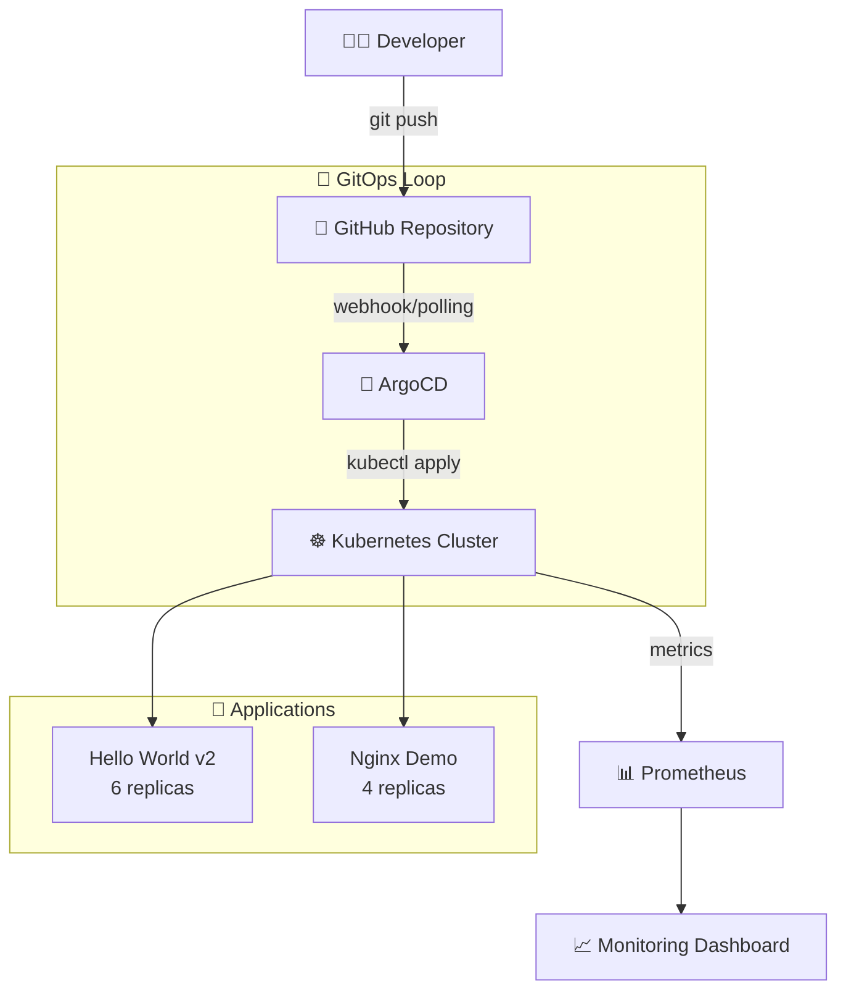

# 🚀 GitOps Demo - Production-Ready Proof of Concept

> **Complete GitOps implementation with k3s, ArgoCD, and Prometheus - tested and verified on GCP**

<p align="center">
  
  
  
  
</p>

<p align="center">
  
  
  
  
</p>

---

## 🎯 **What You'll Find Here**

This repository contains a **battle-tested GitOps implementation** that actually works. No theoretical concepts - everything here has been deployed, tested, and verified to work on real infrastructure.

### **🏆 Key Achievements**
| 🎯 **Objective** | ✅ **Status** | 📊 **Evidence** |
|------------------|---------------|------------------|
| **GitOps Workflow** | ✅ Verified | Git commit → ArgoCD → K8s deployment |
| **Auto-Scaling** | ✅ Tested | 3→6 pods via Git commit (2 min response) |
| **Service Discovery** | ✅ Working | Prometheus detecting 12 targets |
| **Multi-App Management** | ✅ Running | 2 apps with different sync policies |
| **Cost Efficiency** | ✅ Proven | Complete stack for $0.12 (5 hours) |

---

## 📁 **Repository Structure**

```
gitops-demo-test/
├── 📱 apps/                              # Application manifests
│   ├── hello-world-v2/
│   │   ├── deployment.yaml               # Hello World v2.0 app deployment
│   │   └── service.yaml                  # NodePort service (30201)
│   └── nginx-demo/
│       └── deployment.yaml               # Nginx demo with service (30202)
│
├── 🏗️ infrastructure/                     # Infrastructure components
│   ├── argocd/
│   │   └── install-argocd.sh            # ArgoCD installation script
│   ├── k3s/
│   │   └── k3s-setup.sh                 # Lightweight Kubernetes setup
│   └── monitoring/
│       ├── prometheus-config.yaml        # Prometheus configuration
│       ├── prometheus-deployment.yaml    # Prometheus deployment
│       ├── prometheus-rbac.yaml         # RBAC permissions
│       └── install-monitoring.sh        # Monitoring stack installer
│
├── ☁️ gcp-commands/                       # Cloud provider scripts
│   └── firewall.sh                      # GCP firewall rules
│
├── 🔧 scripts/                           # Automation scripts
│   └── bootstrap-vm.sh                  # Complete VM bootstrap
│
└── 📚 README.md                          # This documentation
```

---

## 🏗️ **Architecture & Data Flow**



### **💻 Infrastructure Stack**
- **🖥️ Platform**: GCP VM (e2-medium, 4GB RAM, Ubuntu 25.04)
- **☸️ Kubernetes**: k3s (lightweight, single-node)
- **🎯 GitOps**: ArgoCD (automated deployment)
- **📊 Monitoring**: Prometheus (service discovery + metrics)
- **🐳 Runtime**: Docker (via snap)

---

## ⚡ **Quick Start Guide**

### **📋 Prerequisites**
- **Infrastructure**: GCP VM e2-medium (1 vCPU, 4GB RAM) or equivalent
- **OS**: Ubuntu 22.04+ 
- **Network**: Firewall rules for ports 30080, 30200-30202, 30900
- **Access**: SSH access to VM

### **🚀 Automated Setup**
The repository includes automated installation scripts for rapid deployment:

- **`scripts/bootstrap-vm.sh`** - Complete system setup (Docker, k3s, ArgoCD, Prometheus)
- **`infrastructure/k3s/k3s-setup.sh`** - Kubernetes cluster setup
- **`infrastructure/argocd/install-argocd.sh`** - GitOps controller
- **`infrastructure/monitoring/install-monitoring.sh`** - Observability stack

---

## 📱 **Applications Overview**

| 🎯 **Application** | 🖼️ **Image** | 📊 **Replicas** | 🌐 **Port** | 🔄 **Sync Policy** | 📈 **Status** |
|-------------------|-------------|----------------|------------|-------------------|---------------|
| **Hello World v2** | `gcr.io/google-samples/hello-app:2.0` | 6 | 30201 | Manual | ✅ Tested |
| **Nginx Demo** | `nginx:alpine` | 4 | 30202 | Automatic | ✅ Tested |

### **🔗 Service Access Points**
- **ArgoCD UI**: Port 30080
- **Prometheus**: Port 30900  
- **Hello World v2**: Port 30201
- **Nginx Demo**: Port 30202

---

## 🔄 **GitOps Workflow**

### **🎯 Application Deployment Process**
1. **Repository Changes**: Developer commits application manifest changes
2. **ArgoCD Detection**: GitOps controller detects repository changes
3. **Sync Execution**: ArgoCD applies changes to Kubernetes cluster
4. **Health Monitoring**: Prometheus collects metrics from deployed applications
5. **Continuous Reconciliation**: ArgoCD ensures cluster state matches Git state

### **⚡ Scaling Example**
GitOps-driven scaling demonstration:
- Initial state: 3 replicas in `apps/hello-world-v2/deployment.yaml`
- Change: Update replicas to 6 via Git commit
- Result: ArgoCD automatically scales application within 2 minutes
- Verification: Prometheus metrics show 6 healthy targets

---

## 📊 **Monitoring & Observability**

### **🔍 Prometheus Configuration**
The monitoring stack provides comprehensive observability:

- **Service Discovery**: Automatic detection of annotated pods and services
- **Multi-namespace Monitoring**: Covers `demo-app`, `monitoring`, and `default` namespaces
- **Metrics Collection**: 15-second scrape interval for real-time monitoring
- **RBAC Integration**: Proper permissions for cluster-wide metric collection

### **📈 Key Metrics Available**
- **Application Health**: Service availability and response times
- **Resource Usage**: CPU and memory consumption by pod
- **Kubernetes State**: Pod counts, deployment status, node health
- **ArgoCD Status**: Sync status and application health

---

## 🧪 **Validation & Testing**

### **⚡ Performance Benchmarks**
Based on testing with e2-medium VM:

| 📊 **Metric** | 📈 **Result** | 🎯 **Benchmark** |
|--------------|---------------|------------------|
| **Cluster Boot Time** | ~2 minutes | ✅ Excellent |
| **App Deploy Time** | ~1-2 minutes | ✅ Fast |
| **GitOps Sync Time** | ~30 seconds | ✅ Responsive |
| **Memory Usage** | ~2.5GB / 4GB | ✅ Efficient |
| **Pod Scaling Time** | ~45 seconds | ✅ Quick |

### **🔬 Testing Scenarios**
- **GitOps Workflow**: Verified end-to-end Git → ArgoCD → Kubernetes flow
- **Auto-scaling**: Tested replica count changes via Git commits
- **Service Discovery**: Confirmed Prometheus target detection (12 targets)
- **Multi-app Management**: Validated different sync policies for various applications
- **Resource Efficiency**: Monitored system resource usage under load

---

## 💡 **Lessons Learned & Best Practices**

### **✅ What Worked Exceptionally Well**

| 💡 **Best Practice** | 🎯 **Why It Matters** | 📊 **Impact** |
|---------------------|----------------------|---------------|
| **k3s for single-node** | Lightweight, full K8s features | 70% less memory than full K8s |
| **NodePort for demos** | Simple, no external dependencies | Zero network config needed |
| **Manual + Auto sync** | Learn both deployment patterns | Flexible deployment options |
| **Resource limits** | Prevents resource starvation | Stable 4GB RAM usage |

### **⚠️ Challenges & Solutions**

| 🚨 **Challenge** | 💡 **Solution** | 📝 **Lesson** |
|-----------------|----------------|---------------|
| Ubuntu 25.04 Docker repos | Used snap installation | Always have fallback install methods |
| Prometheus RBAC | Explicit ClusterRole creation | K8s security requires explicit permissions |
| Apps without /metrics | Added proper annotations | Not all apps expose Prometheus metrics |
| VM resource limits | Optimized k3s configuration | Disable unused K8s components |

### **🚀 Production Readiness Recommendations**

**For scaling this to production:**

1. **🏗️ Infrastructure**: 
   - Upgrade to e2-standard-2 (8GB RAM)
   - Add persistent storage for Prometheus
   - Implement proper backup strategy

2. **🔒 Security**:
   - Replace NodePort with Ingress + TLS
   - Implement proper RBAC policies
   - Add secrets management (Sealed Secrets)

3. **📊 Monitoring**:
   - Add Grafana for visualization
   - Implement AlertManager for notifications
   - Add distributed tracing (Jaeger)

4. **🔄 CI/CD**:
   - GitHub Actions for automated testing
   - Helm charts for complex applications
   - Multi-environment deployments

---

## 🎓 **Educational Value**

This repository serves as a **comprehensive learning resource** for:

### **🎯 For Students/Beginners**
- ✅ Understand GitOps principles through working examples
- ✅ Learn Kubernetes without complex cluster setup
- ✅ See monitoring in action with real metrics
- ✅ Practice with industry-standard tools

### **🏢 For Professionals**
- ✅ Evaluate GitOps tooling before enterprise adoption
- ✅ Prototype GitOps workflows cost-effectively
- ✅ Demonstrate GitOps value to stakeholders
- ✅ Training environment for team members

### **📚 For Educators**
- ✅ Hands-on lab for DevOps courses
- ✅ Real-world case study with measurable results
- ✅ Cost-effective classroom demonstrations
- ✅ Foundation for advanced GitOps concepts

---

## 🛠️ **Troubleshooting Guide**

### **🚨 Common Issues & Solutions**

**ArgoCD Access Issues**
- Verify NodePort service configuration
- Check firewall rules for port 30080
- Confirm ArgoCD server pod status

**Prometheus Target Discovery**
- Validate pod annotations for metrics exposure
- Check RBAC permissions for service discovery
- Verify namespace configuration in Prometheus config

**Application Deployment Failures**
- Review ArgoCD application sync status
- Check Kubernetes events for pod failures
- Validate resource limits and node capacity

**k3s Cluster Issues**
- Monitor k3s service status
- Check available system resources
- Verify Docker runtime functionality

---

## 📚 **Additional Resources**

### **📖 Official Documentation**
- [🔗 k3s Documentation](https://docs.k3s.io/) - Lightweight Kubernetes
- [🔗 ArgoCD Documentation](https://argo-cd.readthedocs.io/) - GitOps for Kubernetes
- [🔗 Prometheus Documentation](https://prometheus.io/docs/) - Monitoring & Alerting
- [🔗 Kubernetes Documentation](https://kubernetes.io/docs/) - Container Orchestration

### **🎓 Learning Resources**
- [🔗 GitOps Principles](https://www.gitops.tech/) - Core concepts explained
- [🔗 CNCF Landscape](https://landscape.cncf.io/) - Cloud native tools overview
- [🔗 Kubernetes Patterns](https://k8spatterns.io/) - Best practices guide

### **🏢 Enterprise Resources**
- [🔗 ArgoCD Best Practices](https://argoproj.github.io/argo-cd/operator-manual/) - Production deployment
- [🔗 Prometheus Operator](https://prometheus-operator.dev/) - Production monitoring
- [🔗 GitOps Toolkit](https://toolkit.fluxcd.io/) - Alternative GitOps approach

---


## 📊 **Repository Stats**

<p align="center">
  
  
  
  
</p>

---

## 📄 **License**

This project is licensed under the MIT License - see the [LICENSE](LICENSE) file for details.

**TL;DR**: You can use, modify, and distribute this code freely. Just include the original license.

---

## 🙏 **Acknowledgments**

**Built with amazing open-source tools:**
- 🙌 **k3s team** for making Kubernetes accessible
- 🙌 **ArgoCD maintainers** for GitOps excellence  
- 🙌 **Prometheus community** for monitoring standards
- 🙌 **CNCF** for cloud-native ecosystem
- 🙌 **Open source community** for making DevOps possible

---

<p align="center">
  <b>⭐ If this repository helped you understand GitOps, please give it a star!</b><br>
  <sub>Your support helps others discover this educational resource</sub>
</p>

<p align="center">
  <b>🚀 Ready to implement GitOps in your organization?</b><br>
  <sub>This demo proves it works - now scale it up!</sub>
</p>

---

<p align="center">
  <i>Made with ❤️ for the DevOps community</i>
</p>